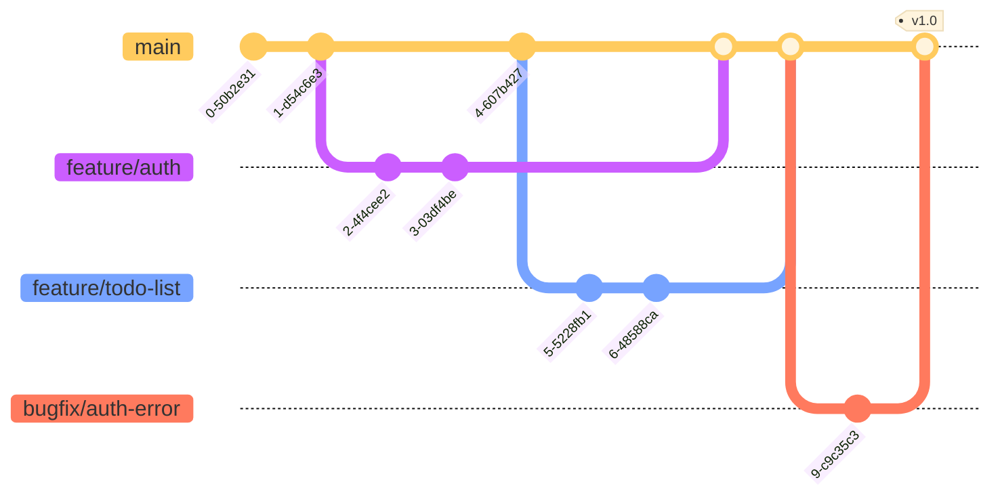
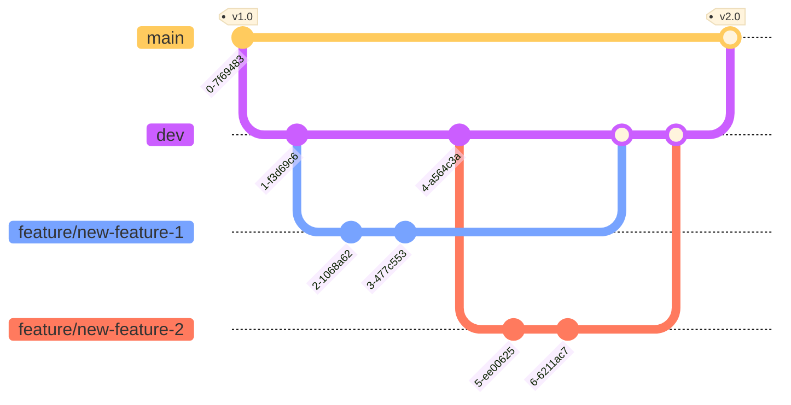
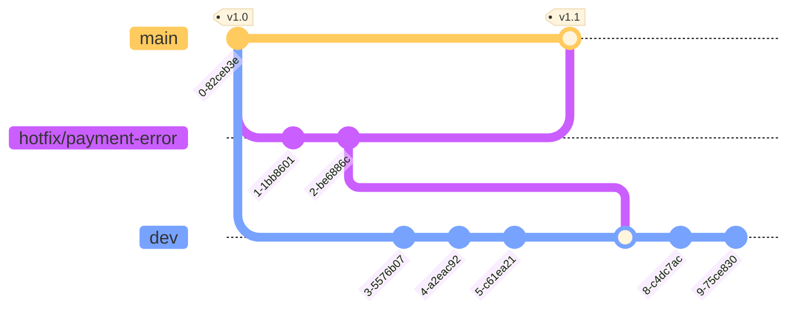

# Git Best Practices

## Branch naming conventions

### Long-lived branches

- `main` - main branch, contains the latest stable version of the code;
- `dev` - development branch, contains the latest development version of the code;

### Short-lived branches

- `feature/*` - branch for new feature development;
- `bugfix/*` - branch for bug fixing;
- `hotfix/*` - branch for urgent bug fixing in released version;
- `refactor/*` - branch for code refactoring;

### Tags

- `v*.*` - tag for released version;

## Workflows

### Simplified workflow

At early stages of a new product it makes sense to use Trunk-bases workflow.

- each merge request to main runs CI pipelines for linting and testing;
- each closed merge request or commits to main runs CD pipeline to build and deploy to testing server;

### Development workflow

Used in order to separate development version from released version.

- each merge request to `dev` runs CI pipelines for linting and testing;
- each closed merge request or commits to `dev` runs CD pipeline to build and deploy to testing server;

### Hot-fix workflow

Used when it is required to make an urgent fix to a released version. 
After closing hotfix branch, it is merged back to main and dev branches.

