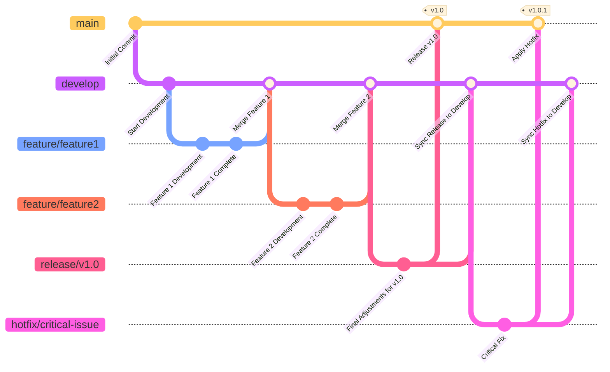

### Gitflow Workflow

The **Gitflow Workflow** is a popular branching model designed to facilitate the management of complex development processes, particularly for projects involving versioned releases and active collaboration.

---

## **Use Cases**:
- **Complex projects with planned releases**:  
  Ideal for teams working on software with a fixed release schedule, such as major product updates.
- **Collaboration across multiple features**: 
  Supports parallel development by allowing isolated feature branches for each new addition or improvement.
- **Clear separation of stable code and ongoing development**:  
  Ensures the stability of the mainline code while allowing continuous development of features and bug fixes.

## **Key Features**:
- **Branch hierarchy**: Central branches such as `main` (or `master`) for releases and `develop` for ongoing development.
- **Dedicated branch types**: Specific purposes for branches:
    - **Feature branches**: For new features.
    - **Release branches**: For preparing releases.
    - **Hotfix branches**: For critical bug fixes.
- **Stable deployment**: Code in `main` is always production-ready, while `develop` contains the latest completed features.

## **Rules**:

- **Main branch (`main`)**:
    - Represents the production-ready code.
    - Only receives changes from merged release or hotfix branches.
- **Develop branch (`develop`)**:
    - Represents the latest working version of the product under development.
    - Serves as a base for feature branches and integrates completed features.
- **Feature branches (`feature/<name>`)**:
    - Created from `develop`.
    - Used to develop specific features.
    - Merged back into `develop` when complete.
- **Release branches (`release/<version>`)**:
    - Created from `develop` when a release is ready for preparation.
    - Used for final adjustments, testing, and versioning.
    - Merged into `main` and `develop`.
- **Hotfix branches (`hotfix/<name>`)**:
    - Created from `main` to address urgent production issues.
    - Merged into both `main` and `develop` to ensure the fix is reflected in future development.

## **Challenges**:

- **Overhead for small teams**: Gitflow’s structured branching can feel cumbersome for small, fast-paced teams with simpler workflows.
- **Complex merge conflicts**: With multiple long-lived branches, frequent merges can lead to complex conflicts, especially in large teams.
- **Maintenance of branch consistency**: Teams must rigorously follow conventions to prevent branch misuse or out-of-sync codebases.

## Example:

## References:

- https://www.atlassian.com/git/tutorials/comparing-workflows/gitflow-workflow