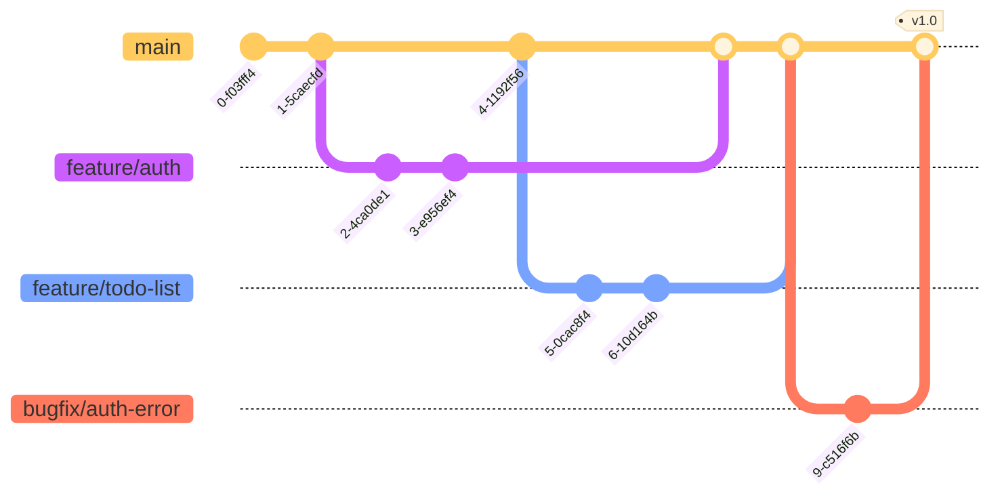

# Trunk-Based Workflow

Trunk-based workflow is a Git strategy where all developers work on a single branch, often called "trunk" or "main." Changes are small and integrated frequently.

## Use Cases:

- **CI/CD Environments:**  
  Works well with automated pipelines for frequent integration and deployment.
- **Shared Feature Development:**  
  Teams can collaborate easily, avoiding complex merge conflicts.
- **Hotfixes or Small Projects:**  
  Simplifies development for short-lived or urgent tasks.

## Key Features:

- **Single Branch Development:**  
  Developers integrate changes directly into the trunk.
- **Frequent Commits:**  
  Small, incremental changes reduce the risk of breaking the code.
- **Feature Toggles:**  
  Unfinished features are hidden or disabled without impacting the trunk.
- **Simple History:**  
  The Git history stays linear and easy to follow.

## Rules:

- Developers may work directly on `main` (if small changes) or create short-lived branches for specific features or fixes.
- Code changes are committed frequently, ideally once a task is completed.
- Branches are merged back into the trunk as soon as possible to reduce drift from the `main` branch.
- Branches are deleted after merging to keep the repository clean.
- Each commit or pull request to `main` triggers CI to test the changes. If the CI tests fail, changes are fixed immediately before continuing.
- Releases are made directly from the trunk or through lightweight tagging mechanisms.

## Challenges:

- **Requires Discipline:**
  Code must always be ready to deploy.
- **Team Coordination:**
  Developers need to communicate to avoid conflicts.
- **Scalability Issues:**
  Larger teams can face contention when committing to one branch.
- **Managing Incomplete Features:**  
  Feature toggles add complexity and need cleanup.

## Example:

## References:

- https://www.atlassian.com/continuous-delivery/continuous-integration/trunk-based-development